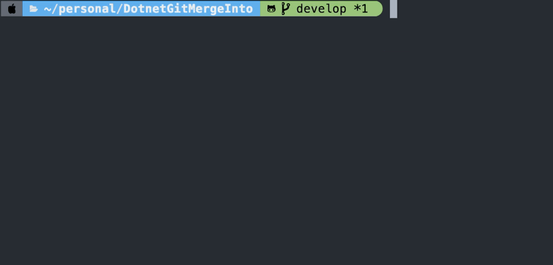

# Merge Tool

## Table of Contents

<!-- toc -->

- [Usage](#usage)
- [Installation](#installation)
  * [Linux](#linux)
  * [MacOS](#macos)
  * [Windows](#windows)
- [Uninstall](#uninstall)
  * [Linux](#linux-1)
  * [MacOS](#macos-1)
  * [Windows](#windows-1)

<!-- tocstop -->

## Usage
```bash
MergeTool gmi {branch}
MergeTool gmip {branch}
```



## Installation

### Linux
```bash
bash -c "$(curl -fsSL https://raw.githubusercontent.com/iml885203/DotnetMergeTool/main/tools/install-linux.sh)"
```

### MacOS
```bash
bash -c "$(curl -fsSL https://raw.githubusercontent.com/iml885203/DotnetMergeTool/main/tools/install-macos.sh)"
```

### Windows
> Todo...

## Uninstall

### Linux
```bash
bash -c "$(curl -fsSL https://raw.githubusercontent.com/iml885203/DotnetMergeTool/main/tools/uninstall.sh)"
```

### MacOS
```bash
bash -c "$(curl -fsSL https://raw.githubusercontent.com/iml885203/DotnetMergeTool/main/tools/uninstall.sh)"
```

### Windows
> Todo...
