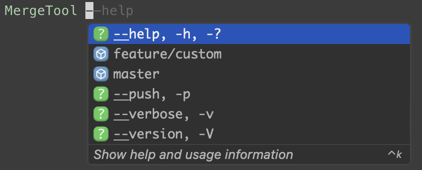

# Merge Tool

Git merge tool


## Table of Contents

<!-- toc -->

- [Usage](#usage)
- [Installation](#installation)
  * [Linux](#linux)
  * [MacOS](#macos)
  * [Windows](#windows)
- [Uninstall](#uninstall)
  * [Linux](#linux-1)
  * [MacOS](#macos-1)
  * [Windows](#windows-1)
- [Why need Merge Tool?](#why-need-merge-tool)
  * [See More...](#see-more)
- [CLI completions (macOS only)](#cli-completions-macos-only)
  * [How to setup Amazon Q Autocomplete for MergeTool](#how-to-setup-amazon-q-autocomplete-for-mergetool)

<!-- tocstop -->

## Usage
```bash
MergeTool {branch}
MergeTool {branch} --push
```

Or you can use the alias:
```bash
gmi {branch}
gmip {branch}
```

## Installation

### Linux
```bash
bash -c "$(curl -fsSL https://raw.githubusercontent.com/iml885203/DotnetMergeTool/main/tools/install-linux.sh)"
```

### MacOS
```bash
bash -c "$(curl -fsSL https://raw.githubusercontent.com/iml885203/DotnetMergeTool/main/tools/install-oxs.sh)"
```

### Windows

Open PowerShell as Administrator and run the following command:

```powershell
powershell -command "& {Invoke-Expression ((New-Object System.Net.WebClient).DownloadString('https://raw.githubusercontent.com/iml885203/DotnetMergeTool/main/tools/install.ps1'))}"
```

## Uninstall

### Linux
```bash
bash -c "$(curl -fsSL https://raw.githubusercontent.com/iml885203/DotnetMergeTool/main/tools/uninstall.sh)"
```

### MacOS
```bash
bash -c "$(curl -fsSL https://raw.githubusercontent.com/iml885203/DotnetMergeTool/main/tools/uninstall.sh)"
```

### Windows
```powershell
powershell -command "& {Invoke-Expression ((New-Object System.Net.WebClient).DownloadString('https://raw.githubusercontent.com/iml885203/DotnetMergeTool/main/tools/uninstall.ps1'))}"
```

## Why need Merge Tool?

**Merge Tool is more user-friendly and has a better error handling mechanism.**

It will checkout back to your original branch when an error occurs.

### [See More...](./why-need-merge-tool.md)

## CLI completions (macOS only)



### [How to setup Amazon Q Autocomplete for MergeTool](./q-autocomplete/README.md)