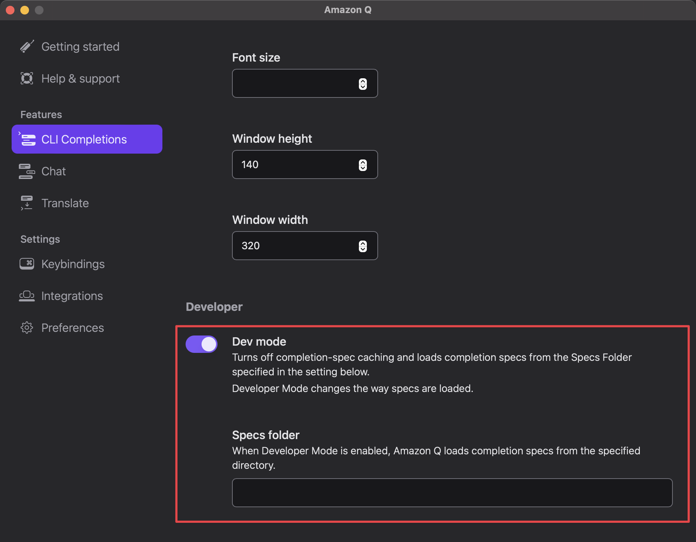
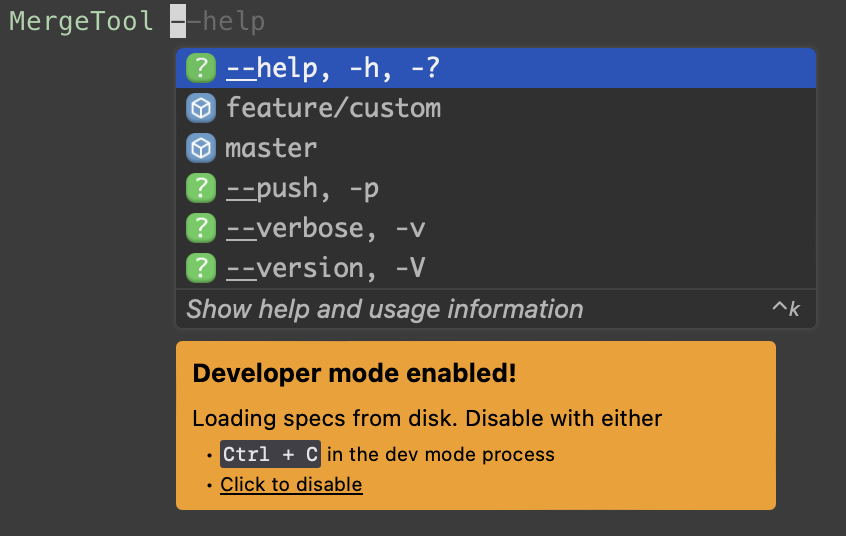
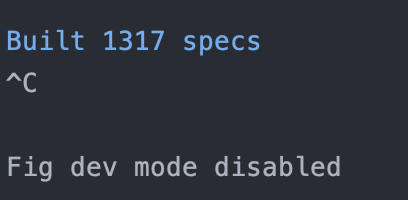
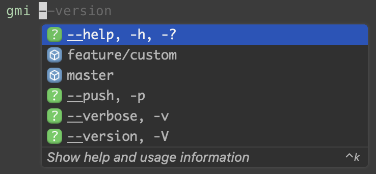

# How to setup Amazon Q Autocomplete for MergeTool

## Requirements
- [Amazon Q for command line (macOS only)](https://docs.aws.amazon.com/amazonq/latest/qdeveloper-ug/command-line-getting-started-installing.html)

## Setup custom specs

1. Clone the repo and setup custom specs
```shell
# Clone the repo
https://github.com/withfig/autocomplete.git
cd autocomplete

# Install packages
pnpm install

# Download MergeTool.ts to src folder
curl -fsSL -o src/MergeTool.ts https://raw.githubusercontent.com/iml885203/DotnetMergeTool/main/src/MergeTool.ts

# Turn on "dev mode"
pnpm dev
```

2. Turn on "dev mode" on Amazon Q



3. Try typing `MergeTool` in terminal



4. `Ctl + c` to exit `pnpm dev`



5. Enable "dev mode" on Amazon Q again for loads the new specs


6. Enjoy the auto complete for MergeTool


