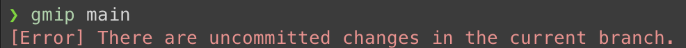
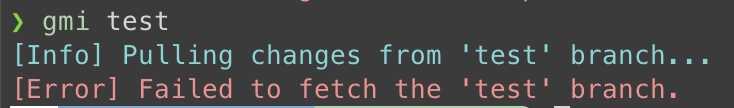
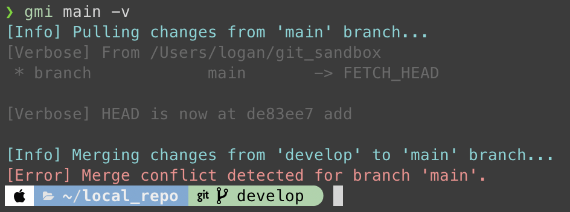
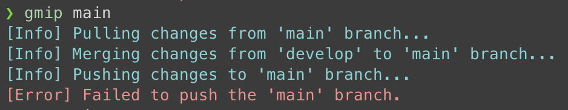

# Why need Merge Tool?

**Merge Tool** is a tool that helps you merge your current branch into another branch.

## Table of Contents

<!-- toc -->

- [Git aliases](#git-aliases)
- [Merge Tool is better than git aliases](#merge-tool-is-better-than-git-aliases)
  * [Uncommitted changes](#uncommitted-changes)
  * [Fetch failed](#fetch-failed)
  * [Merge conflict](#merge-conflict)
  * [Push failed](#push-failed)

<!-- tocstop -->

## Git aliases
You can do the same thing by simple git aliases.

Example:

```shell
git config --edit --global
```

add the following lines:

```bash
[alias]
    mi = !sh -c '_CURRENT_BRANCH=$(git symbolic-ref --short HEAD) && git checkout $1 && git pull && git merge $_CURRENT_BRANCH && git checkout $_CURRENT_BRANCH' -
    mip = !sh -c '_CURRENT_BRANCH=$(git symbolic-ref --short HEAD) && git checkout $1 && git pull && git merge $_CURRENT_BRANCH && git push && git checkout $_CURRENT_BRANCH' -
```

Now you can use `git mi` and `git mip` to merge your current branch into another branch.

```bash
git mi {branch}
git mip {branch}
```

## Merge Tool is better than git aliases

**Merge Tool is more user-friendly and has a better error handling mechanism.**

It will checkout back to your original branch when an error occurs.

### Uncommitted changes



### Fetch failed



### Merge conflict



### Push failed


